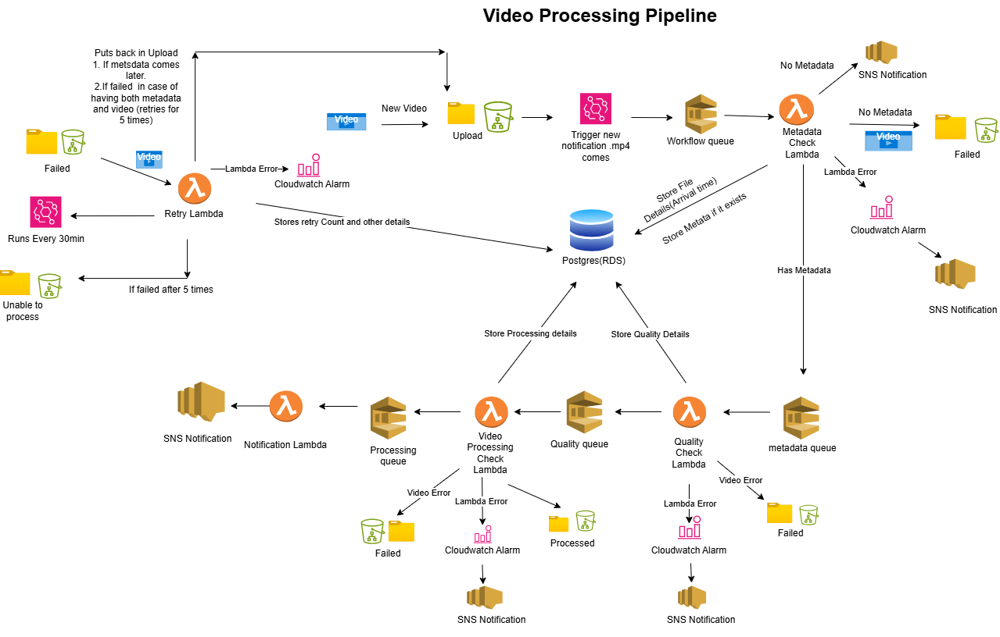

# Video Processing Pipeline

This project implements a robust video processing pipeline designed to handle and streamline the upload, processing, and quality control of video files. Built on AWS, the pipeline leverages various services including Lambda, SNS, CloudWatch, and RDS (PostgreSQL) to automate the video handling process efficiently.

The pipeline is structured to manage the lifecycle of a video from its initial upload to the final storage after successful processing and quality checks. It ensures that videos with necessary metadata proceed for further processing, while appropriately handling errors and retry mechanisms. The system also integrates detailed logging and notification mechanisms to monitor the process flow and alert on critical issues.

Key features include:

1. Automated video uploads and metadata checks.
2. Retry logic for handling processing failures.
3. Quality checks to ensure video standards are met.
4. Cloud-based storage and management of processing details.
5. Real-time notifications for process outcomes.

This setup is ideal for organizations looking to manage large volumes of video content with a need for stringent quality controls and efficient error handling.

# Architechture




# Technologies and Libraries

# Libraries

The pipeline utilizes the following libraries to manage and process video files:

1. FFmpeg: A powerful tool that allows for the conversion of video and audio formats, ensuring compatibility across different platforms and devices.
2. FFprobe: Used for gathering information from multimedia streams and used in this pipeline to verify the content and quality of the video files.

Database
1. PostgreSQL: A robust relational database management system that stores all processing and quality details of the video files.
4. AWS Services
The architecture is built using several AWS services to enhance scalability, reliability, and management of the video processing tasks:

1. AWS CDK Stack: Defines the cloud resources using familiar programming concepts, making it easier to model and provision AWS resources.
2. Amazon SQS: Manages the queue of video processing tasks, ensuring that each video is processed in order without loss of data.
3. Amazon EventBridge: A serverless event bus that connects application data from various sources and routes them to AWS services, used here for scheduling and triggering processing tasks.
4. Amazon S3: Provides scalable object storage for video files and associated metadata. It is used here for storing the raw and processed videos as well as logging the process details.
5. S3 Event Notifications: Configured to trigger Lambda functions for processing steps, based on different events occurring in the S3 buckets like file uploads or updates.


# AWS Console Setup

# S3 Bucket Configuration

1. Create an S3 bucket - Set up a new S3 bucket to store video files. Name the bucket according to your organization's naming conventions.
2. Add subfolders - Inside the bucket, create the following subfolders to organize the video files:
    1. uploads - For storing newly uploaded video files.
    2. failed - For videos that fail processing.
    3. processed - For successfully processed videos.
    4. unable_to_process - For videos that cannot be processed after multiple attempts.

3. RDS PostgreSQL Database
    1. Create an RDS PostgreSQL instance - Set up a new instance of RDS PostgreSQL to store processing logs and video metadata.
    2. Configure security groups - Add appropriate input and output security groups to ensure secure access to the database.

4. Environment variables - Store the database credentials as environment variables during development and use AWS Secrets Manager to handle them securely in production environments.

# Main Stack File Updates 

File Location
Check and update the main stack code in video_processing/video_processing_stack.py.

# Required Updates

1. Import Libraries - Ensure all necessary libraries are imported at the beginning of the file.
2. Bucket ARN Usage - Replace placeholders with the actual Amazon Resource Name (ARN) of the S3 bucket created above.
3. Permissions - Assign necessary AWS permissions to the resources involved in the stack:
    1. Lambda
    2. CloudWatch
    3. SNS
    4. SQS
    5. RDS
    6. S3
4. Environment Variables - Verify that all environment variables are correctly set up for accessing database details and AWS resources. Ensure that these include the S3 bucket and folder names, database credentials, and other relevant configuration details.

5. Stack Verification
Ensure the current stack code correctly creates and configures all queues, Lambda functions, notifications, triggers, and alarms as per the project requirements.


# Test Scenarios

1. Test Missing Metadata Notification

    1. Action: Upload a video file to the uploads subfolder in the S3 bucket without accompanying metadata.
    2. Expected Result: 
        1. Verify that a notification is received indicating the absence of metadata. 
        2. Check for any related CloudWatch alarms or SNS notifications.

2. Test Successful Processing and Database Update

    1. Action: Upload both a video file and its corresponding metadata file to the uploads subfolder.
    2. Expected Result:
        1. Confirm that the video file and metadata are processed correctly.
        2. Check that the database is updated with the new video processing details.
        3. Ensure the processed video file is moved to the processed folder.
        4. Verify that a final notification is sent out confirming successful processing.

3. Test Retry Logic

    1. Action: Manually place a video file in the failed folder.
    2. Expected Result:
        1. Monitor the system to ensure the retry logic is triggered.
        2. Check the CloudWatch logs to confirm that the retry process runs according to the defined retry strategy (e.g., retries up to 5 times).
        3. Verify that an SNS notification is sent after the final retry attempt, detailing whether the file was processed successfully or moved to the unable_to_process folder.


# How to setup Cdk 

Refernce: https://catalog.us-east-1.prod.workshops.aws/workshops/10141411-0192-4021-afa8-2436f3c66bd8/en-US/3000-python-workshop/200-create-project/210-cdk-init

Start intializing the project.

```
cdk init sample-app --language python

```

To manually create a virtualenv on MacOS and Linux:

```
$ python -m venv .venv
```

After the init process completes and the virtualenv is created, you can use the following
step to activate your virtualenv.

```
$ source .venv/bin/activate
```

If you are a Windows platform, you would activate the virtualenv like this:

```
% .venv\Scripts\activate.bat
```

Once the virtualenv is activated, you can install the required dependencies.

```
$ pip install -r requirements.txt
```

At this point you can now synthesize the CloudFormation template for this code.


# Make sure all the resources are pefectly set in the main stack and variables are correctly given

```
$ cdk synth
```

```
$ cdk deploy
```
